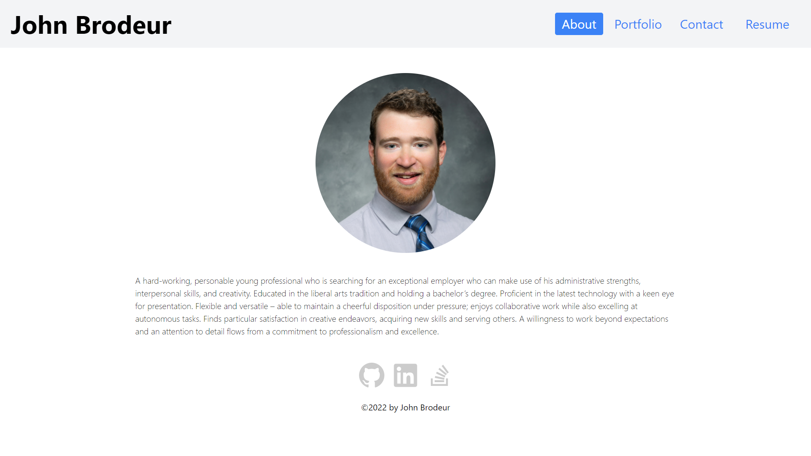

# Portfolio for John Brodeur

## Description

A professional portfolio for prospective employers  
Made with Create React App

## Table of Contents

* [User Story](#user-story)
* [Screenshot](#screenshot)
* [Deployed Application](#installation)
* [Questions](#questions)

## User Story

AS AN employer looking for candidates with experience building single-page applications  
I WANT to view a potential employee's deployed React portfolio of work samples  
SO THAT I can assess whether they're a good candidate for an open position  

## Screenshot

## Deployed Application
[https://jpdbrodeur.github.io/portfolio/](https://jpdbrodeur.github.io/portfolio/)

## Questions

* GitHub Profile: [JPDBrodeur](https://github.com/JPDBrodeur)

* Have any additional questions? You can reach me by email at [jbrodeur001@gmail.com](mailto:jbrodeur001@gmail.com).